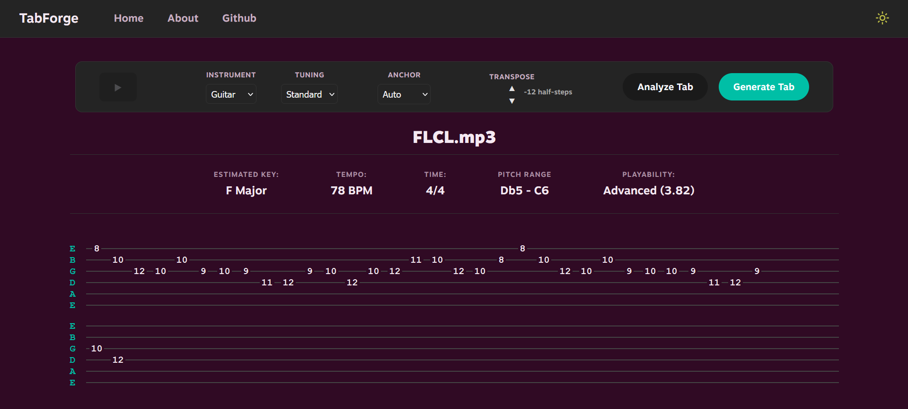

# TabForge

A full-stack web application that converts MIDI files and raw audio recordings into playable guitar tablature. Upload a MIDI file or audio track and receive an optimized, human-playable tab within seconds.

> **Note:** This repository contains a curated excerpt of the project for portfolio purposes. Full production source code is available upon request.

---

## Demo



*Upload a MIDI or audio file → configure instrument and tuning → generate optimized tab*

---

## How It Works

### The Core Problem

A single musical pitch can be played on multiple different string/fret combinations on a guitar. A naive approach — always picking the lowest fret, or always preferring a specific string — produces tab that is technically correct but physically awkward to play. The challenge is finding the sequence of positions that minimizes total hand movement across the whole piece.

### The Pipeline

```
Audio / MIDI file
       │
       ▼
┌─────────────────┐
│  Basic Pitch    │  (audio only) Spotify's ML model transcribes
│  Transcription  │  raw audio to a structured MIDI representation
└────────┬────────┘
         │
         ▼
┌─────────────────┐
│   MidiMelody    │  Parses MIDI, extracts notes, groups simultaneous
│   Parsing &     │  notes into ChordSteps within a 30ms onset window,
│   Grouping      │  estimates key/tempo/time signature
└────────┬────────┘
         │
         ▼
┌─────────────────┐
│   Fretboard     │  Builds a complete pitch → [Position] mapping for
│   Model         │  the selected instrument and tuning
└────────┬────────┘
         │
         ▼
┌─────────────────┐
│   TabGenerator  │  Viterbi dynamic programming finds the globally
│   Viterbi DP    │  optimal fingering sequence across the whole piece
└────────┬────────┘
         │
         ▼
    Guitar Tab
```

### The Optimization Algorithm

The tab generator uses a **Viterbi dynamic programming** approach — the same class of algorithm used in speech recognition and bioinformatics sequence alignment — adapted here for guitar ergonomics.

Every note (or chord) in the melody becomes a **layer** in the DP graph. Each layer contains all physically playable fingering candidates for that time step. The algorithm finds the path through the graph that minimizes total transition cost.

**Playability constraints** prune the candidate space before the DP runs:
- No two notes in a chord may share the same string
- The fret span of any chord fingering may not exceed 4 frets (open strings excluded, as they require no fretting finger)

**Transition cost** between consecutive chord states has three components:

| Component | Weight | Rationale |
|---|---|---|
| Frame movement | 1.0× | Mean absolute fret distance from the previous hand position centroid |
| String displacement | 0.5× | Mean absolute string change — less costly than fret jumps |
| Anchor deviation | 2.5× | Distance from a preferred hand anchor fret (optional) |

Using the **centroid** of the previous chord state (rather than pairing individual notes) means voicing changes within the same fret region are not penalized — only genuine hand shifts up or down the neck.

The result is a globally optimal fingering sequence: not just locally smooth transitions, but the arrangement that minimizes total physical effort across the entire piece.

### Polyphonic Support

The pipeline handles both monophonic melodies and polyphonic harmonies uniformly. Every time step is represented as a `ChordStep` — a sorted list of simultaneous MIDI pitches. Single notes are 1-element `ChordStep`s. The Viterbi DP operates over `ChordState` tuples (one `Position` per pitch) regardless of whether the input is monophonic or polyphonic, so no special casing is required.

When a cluster exceeds the instrument's practical chord limit (4 notes), the trimming algorithm keeps the bass and melody voices unconditionally and samples inner voices evenly to preserve harmonic spread.

---

## Tech Stack

**Backend**
- Python / FastAPI
- [pretty_midi](https://github.com/craffel/pretty-midi) — MIDI parsing
- [Basic Pitch](https://github.com/spotify/basic-pitch) (Spotify) — audio-to-MIDI transcription
- NumPy — key/tempo estimation algorithms
- Redis — file registry with TTL-based expiry and keyspace notification cleanup

**Frontend**
- React + TypeScript + Vite
- [Tonal.js](https://github.com/tonaljs/tonal) — MIDI pitch to note name conversion

---

## Project Structure (excerpt)

```
src/
├── Position.py        # Frozen dataclass: (string, fret)
├── ChordStep.py       # Dataclass: simultaneous MIDI pitches at one onset
├── Fretboard.py       # Pitch → [Position] mapping for any tuning
├── MidiMelody.py      # MIDI parsing, chord grouping, musical analysis
├── TabGenerator.py    # Viterbi DP optimizer — the core algorithm
├── schemas.py         # Pydantic request models
└── utilities.py       # Serialization and analysis helpers
api.py                 # FastAPI application and endpoints
```

---

## Key Design Decisions

**Why Viterbi DP instead of a greedy approach?**
A greedy algorithm picks the locally cheapest position at each step but can paint itself into a corner — a seemingly good choice early in a phrase forces an expensive jump later. Viterbi finds the globally optimal path in O(N × S²) time, where N is the number of time steps and S is the number of candidate states per step. For a typical melody this runs in milliseconds.

**Why chord-state tuples as DP states?**
Representing each state as a `Tuple[Position, ...]` rather than a single `Position` means the polyphonic case is a strict generalization of the monophonic case — the code is identical, just operating on larger state objects. It also makes states hashable for O(1) backpointer lookup in the DP table.

**Why the centroid for transition cost instead of note pairing?**
Pairing individual notes between consecutive chords requires choosing a matching (an NP-hard assignment problem for large chords). Using the centroid of the previous state avoids this entirely: the hand's position in space is approximated by its average fret, and the cost of reaching each note in the new chord is measured from that center.

**Why 30ms for the simultaneity window?**
30ms is below the threshold of human rhythmic perception for simultaneous onset (~50ms) but wide enough to tolerate Basic Pitch's timing imprecision on attacked or strummed notes. Notes within this window are grouped as a chord; notes outside it are treated as sequential.

---

## Supported Instruments & Tunings

| Instrument | Tunings |
|---|---|
| Guitar (6-string) | Standard, Drop D, DADGAD |
| Bass (4-string) | Standard, Drop D, Half-step down |
| Ukulele | Standard (Soprano), Low G, Baritone |

Tuning is represented as a list of MIDI pitch numbers, so any custom tuning can be passed via the API without code changes.
Additional tuning and instrument presets are planned for the future.

---

## API Overview

| Method | Endpoint | Description |
|---|---|---|
| `POST` | `/upload-file` | Upload MIDI or audio file; returns `file_id` and pitch range |
| `GET` | `/analyze-melody/{file_id}` | Key, tempo, time signature, pitch range |
| `POST` | `/suggest-anchor/{file_id}` | Suggest optimal hand anchor fret |
| `POST` | `/generate-tab/{file_id}` | Run Viterbi optimizer; return tab positions |
| `POST` | `/export-tab/{file_id}` | Return ASCII tab as plain text |
| `GET` | `/positions/{pitch}` | All fretboard positions for a MIDI pitch |

---

## Full Source

This repository is a curated excerpt for portfolio review. The complete production codebase — including the full frontend implementation, Redis file registry, audio transcription pipeline, and deployment configuration — is available upon request.

Feel free to reach out via [LinkedIn](https://www.linkedin.com/in/jamisonhb/) or email.